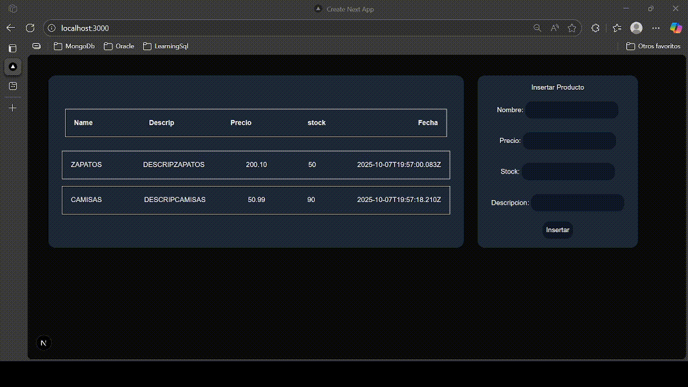

# 🛍️ Proyecto API de Productos

Este proyecto implementa una API simple para la gestión de productos, con conexión a una base de datos **PostgreSQL**.  
Permite **consultar** e **insertar** productos desde una interfaz frontend desarrollada con Next.js.

---

> 🖼️ **Demostración en acción**

<p align="center">
  
</p>

---

## 🚀 Tecnologías Usadas


---

## ⚙️ Configuración de la Base de Datos

Editar el archivo [`src/lib/db.js`](src/lib/db.js) con tus credenciales de conexión a PostgreSQL:

```js
const pool = new Pool({
  user: "tu_usuario",
  password: "tu_contraseña",
  host: "localhost",
  port: 5432,
  database: "tu_base_de_datos"
});
````

**Parámetros a configurar:**

* `user` → Usuario de la base de datos
* `password` → Contraseña
* `host` → Dirección del servidor
* `port` → Puerto de conexión (por defecto: `5432`)
* `database` → Nombre de la base de datos

---

## 📁 Estructura del Proyecto

```
src/
├── app/
│   ├── api/
│   │   └── Products/
│   │       └── route.js   # Controladores GET y POST
│   └── page.jsx           # Página principal (Frontend)
│
├── lib/
│   └── db.js              # Configuración de conexión a PostgreSQL
│
└── services/
    └── list.service.js    # Lógica de negocio (consultas SQL)
```

---

## 🧠 Servicios

📍 Archivo: [`src/services/list.service.js`](src/services/list.service.js)

* **`getList()`** → Obtiene todos los registros de la tabla **Productos**
* **`postList(name, description, price, stock)`** → Inserta un nuevo registro en la tabla **Productos**

---

## 🧩 Controladores API

📍 Archivo: [`src/app/api/Products/route.js`](src/app/api/Products/route.js)

Contiene las rutas API:

* **GET `/api/Products`** → Obtiene todos los productos
* **POST `/api/Products`** → Inserta un nuevo producto

---

## 🌐 Endpoints Disponibles

| Método | Endpoint        | Descripción                 |
| ------ | --------------- | --------------------------- |
| GET    | `/api/Products` | Obtener todos los productos |
| POST   | `/api/Products` | Insertar un nuevo producto  |

---

## 🖥️ Página Principal

📍 Ruta: `/`
Interfaz simple para visualizar los productos registrados e insertar nuevos.

---

## 🧰 Cómo Ejecutar el Proyecto

1. Clona el repositorio

   ```bash
   git clone https://github.com/bskcfv/ListarBsk.git
   cd ListarBsk
   ```

2. Instala las dependencias

   ```bash
   npm install
   ```

3. Configura tus credenciales en `src/lib/db.js`

4. Ejecuta el servidor

   ```bash
   npm run dev
   ```

5. Abre tu navegador en:
   👉 [http://localhost:3000](http://localhost:3000)

---

## ✨ Autor

Desarrollado por **[Cristian Valderrama]**
💼 Proyecto académico / demostrativo de integración **Next.js + PostgreSQL**

